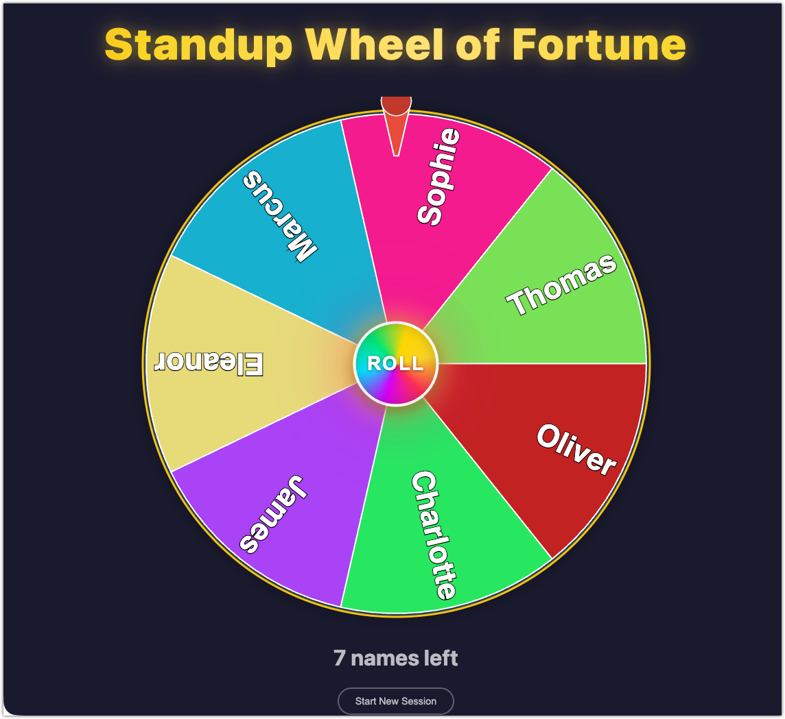
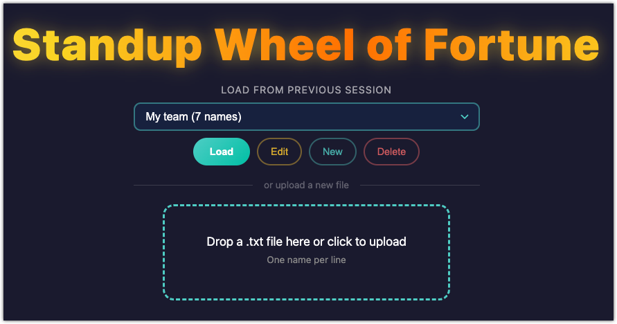
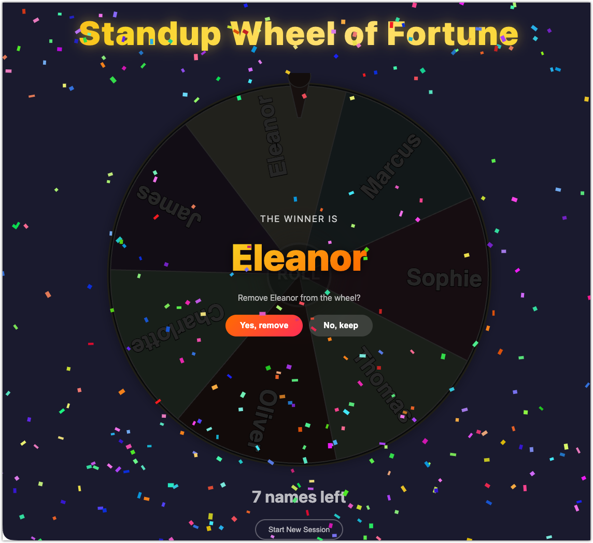

# Standup Wheel of Fortune



A zero-dependency, single-file spinning wheel for picking standup order. Upload your team list, spin, and let fate decide who goes first.

## Features

- **Spin to win** - Realistic deceleration physics with a springy flapper that bounces off each slice
- **Sound effects** - Tick-tick-tick as slices pass, fanfare on winner (Web Audio API, no assets needed)
- **Confetti** - Continuous particle rain while the winner is announced
- **Remove and repeat** - Remove the winner from the wheel and spin again until everyone has gone
- **Team persistence** - Uploaded teams are saved to localStorage so they survive page refreshes
- **Edit teams** - Create, rename, edit, and delete saved team lists directly in the browser
- **Fully self-contained** - Single HTML file, no dependencies, no build step, no server required
- **Responsive** - Works on desktop and mobile, scales to viewport

## Usage

1. Open `index.html` in any modern browser
2. Upload a `.txt` file with one name per line (or select a previously saved team)
3. Click **ROLL** and watch the wheel spin
4. Winner is announced with confetti and fanfare
5. Choose to remove the winner or keep them for the next round
6. Repeat until everyone has had their turn

A sample file (`test-names.txt`) is included for quick testing.

## Managing Teams

Once you upload a file, it is automatically saved to your browser's localStorage. On return visits you will see a dropdown with your saved teams. From there you can:

- **Load** a saved team directly onto the wheel
- **Edit** names or rename the list
- **New** to create a fresh list without a file
- **Delete** teams you no longer need

## Screenshots

| Selecting a team | The wheel | Winner! |
|:---:|:---:|:---:|
|  |  |  |

## Requirements

- A modern browser (Chrome, Firefox, Safari, Edge)
- That's it. No Node, no npm, no build tools.

## Files

```
.
├── index.html          # The entire application
├── test-names.txt      # Sample names file for testing
├── wheel-spec.md       # Full technical specification
├── images/
│   ├── wheel.png       # Screenshot of the wheel
│   ├── winner.png      # Screenshot of winner announcement
│   ├── select-team.png # Screenshot of team selection
│   └── new-list.png    # Screenshot of new list modal
└── docs/
    └── plans/          # Development planning docs
```

## License

Do whatever you want with it. It's a wheel.
